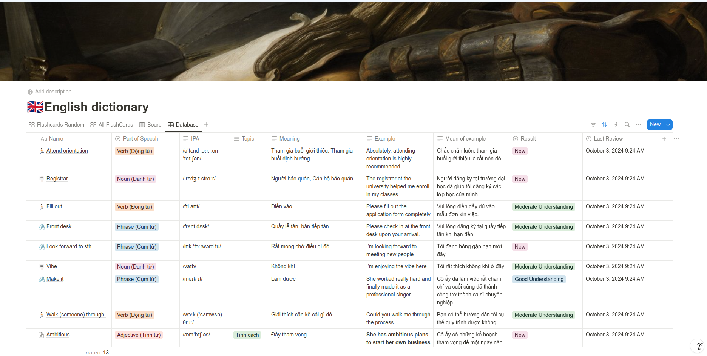
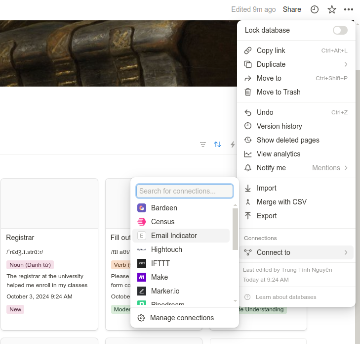
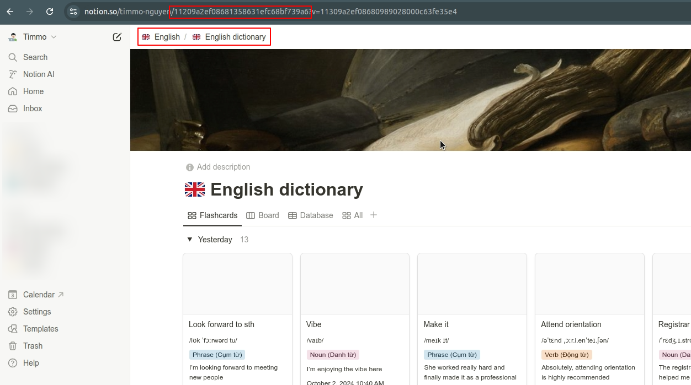
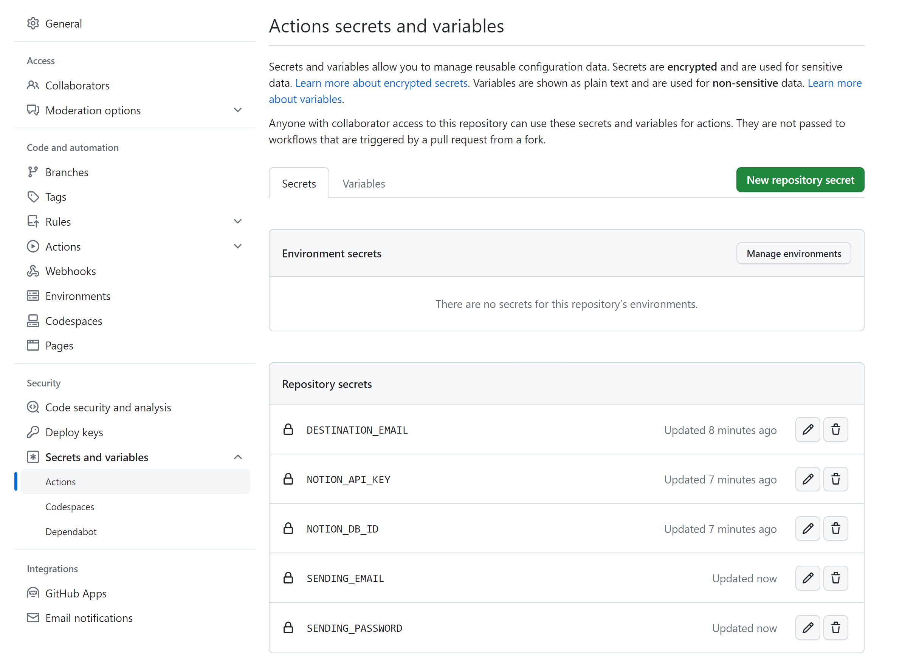
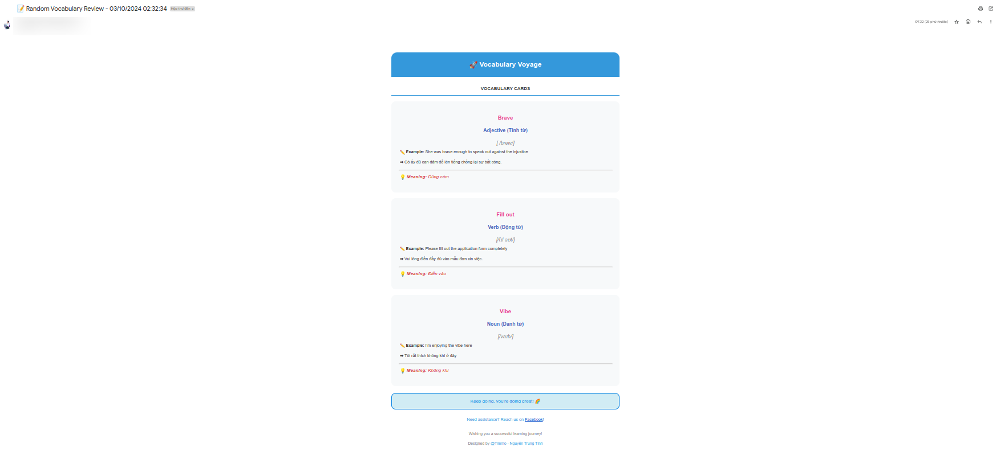

# Notion mailing scheduler

This project help us to schedule sending an email every week from a notion database.

> You could give me a star if this is helpful to you 😊.

## Prerequisites

1. Clone my notion template: [English template](https://timmo-nguyen.notion.site/Share-11409a2ef08680169176d3cbca61678b?pvs=4)
   - Looks like:
     
2. Create an integration at [notion integration](https://www.notion.so/my-integrations), then claim the secret key of the integration.
3. Share the database with an integration.

   Like this:
   

   Copy the database ID
   

4. Prepare gmail account.

   - Enable 2 factor authentication.
   - Create an application password, use that as credential below.

5. A github account

## Setup

1. Fork this repo into your account.
2. Add secret to your project (it will be "secret")

   - `SENDING_EMAIL`: Sending account.
   - `SENDING_PASSWORD`: Password of the sending account (application password) [See more](https://support.google.com/accounts/answer/185833?hl=en).
   - `DESTINATION_EMAIL`: Your email that will be received email automatically.
   - `NOTION_DB_ID`: Notion database ID.
   - `NOTION_API_KEY`: Notion API key.
   - This looks like:
     

3. Modify the cronjob (optional)

   - How to modify the cronjob? See [Crontab.guru](https://crontab.guru/#*_*_*_*_*)
   - Cronjob will take the UTC timezone, remember adjust your local time!

4. Enjoy and ready to learn!
   - Result:
     
